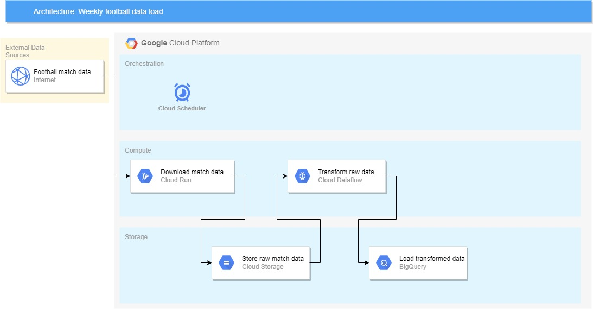

# Football Match Data
## Objective
Load historical football match data from an external source into BigQuery for analytical workloads.
## Architecture

## Useful Resources
- [Build and create a Python job in Cloud Run](https://cloud.google.com/run/docs/quickstarts/jobs/build-create-python)

